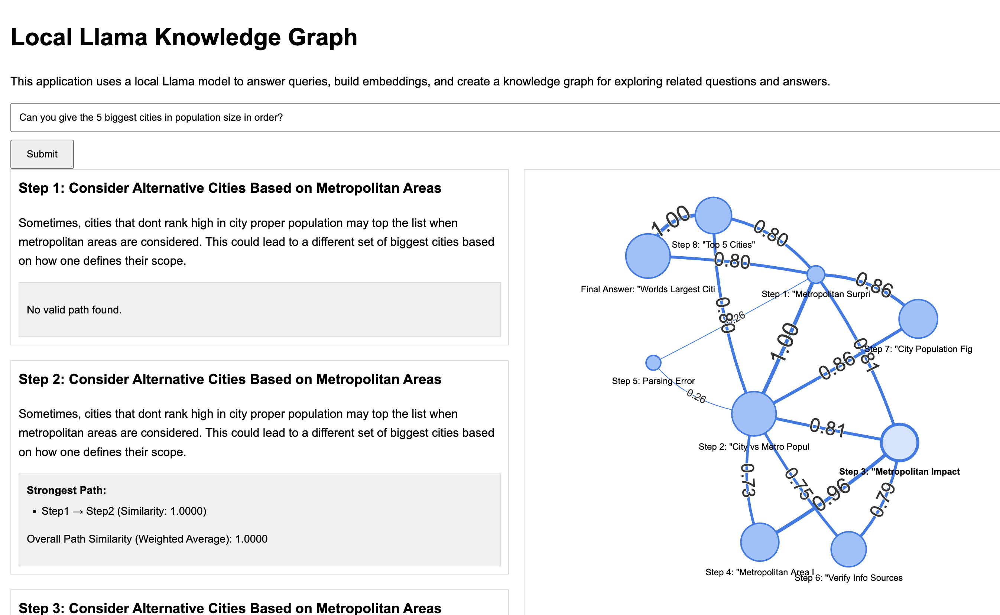

# Local Knowledge Graph



This application uses a local Llama model to answer queries, build embeddings, and create a knowledge graph for exploring related questions and answers.

## Description

The Local Knowledge Graph is a Flask-based web application that leverages a local Llama language model to process user queries, generate step-by-step reasoning, and visualize the thought process as an interactive knowledge graph. It also finds and displays related questions and answers based on semantic similarity.

## Features

- Interactive web interface for submitting queries
- Step-by-step reasoning process displayed in real-time
- Dynamic knowledge graph visualization of the reasoning steps
- Calculation and display of the strongest reasoning path
- Related questions and answers based on semantic similarity
- Local processing using a Llama language model

## Usage

1. Ensure you have all the required dependencies installed.
2. Start the Flask application by running `app.py`.
3. Open a web browser and navigate to `http://localhost:5100` (or the appropriate port if modified).
4. Enter your query in the input field and click "Submit".
5. Watch as the application generates a step-by-step reasoning process, updating the knowledge graph in real-time.
6. Review the final answer and the strongest reasoning path.
7. Explore related questions and answers displayed below the main response.

## Requirements

- Python 3.7+
- Flask
- NumPy
- scikit-learn
- Annoy
- NetworkX
- A local Llama language model (e.g., llama3.1:8b) running on `http://localhost:11434`

## Installation

1. Clone this repository.
2. Install the required Python packages using the requirements.txt file:
   ```
   pip install -r requirements.txt
   ```
3. Ensure you have a local Llama model running and accessible.
4. Run the Flask application:
   ```
   python app.py
   ```

## Note

This application requires a local Llama language model to be running and accessible. Make sure you have the appropriate model set up and running before using this application.