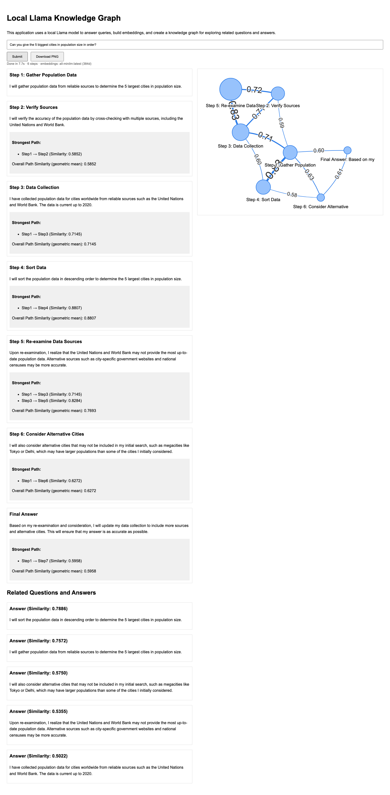

# Local Knowledge Graph



Ask a local Llama model a question, watch it reason step by step, and see the steps drawn as a
knowledge graph where the edges are the semantic similarity between them.

## Requirements

- Python 3.10 or newer
- [Ollama](https://ollama.com) running locally
- One chat model and, ideally, one embedding model

```bash
ollama pull llama3.2:3b        # or llama3.1:8b, or any chat model you already have
ollama pull nomic-embed-text   # optional but recommended, see "Which embedding model" below
```

## Installation

```bash
git clone https://github.com/punnerud/Local_Knowledge_Graph
cd Local_Knowledge_Graph
python3 -m venv .venv && .venv/bin/pip install -r requirements.txt
.venv/bin/python app.py
```

Then open <http://localhost:5100>.

If the app cannot find what it needs it says so on startup and at
<http://localhost:5100/health>, naming the exact `ollama pull` command that fixes it.

## Configuration

Everything is an environment variable, and the defaults work unchanged.

| Variable | Default | Meaning |
|---|---|---|
| `OLLAMA_URL` | `http://localhost:11434` | Where Ollama is listening |
| `LKG_CHAT_MODEL` | `llama3.1:8b` | The model that does the reasoning |
| `LKG_EMBED_MODEL` | *(auto)* | Embedding model. Empty means: use an installed embedding model if there is one, otherwise fall back to the chat model |
| `LKG_HOST` / `LKG_PORT` | `127.0.0.1` / `5100` | Where the app listens |
| `LKG_DEBUG` | off | Set to `1` for the Flask debugger. Do not do this on a shared network |

## Which embedding model, and why it matters

The edges in the graph are cosine similarities, so how much they vary decides whether the
picture tells you anything. Measured over four unrelated six-step reasoning chains
(`make measure`, recorded in `data/claims/edge_spread.json`):

| Model | Dimensions | Mean edge weight | Coefficient of variation |
|---|---|---|---|
| `all-minilm` | 384 | 0.48 ± 0.07 | **0.28 ± 0.11** |
| `nomic-embed-text` | 768 | 0.67 ± 0.05 | **0.13 ± 0.03** |

The uncertainties are the spread across the four topics. The larger model produces the
*less* discriminative graph here: under `nomic-embed-text` almost every pair of reasoning
steps scores around 0.67, so the edge labels stop distinguishing anything. This is ordinary
distance concentration, and it is a good reason to look at the spread rather than trusting
that a better retrieval model draws a better graph. `all-minilm` is the better default for
the *drawing* even though it is the weaker retriever.

Both work. Any embedding size works — nothing in the code assumes a dimension.

## Embeddings from inside a model

An embedding endpoint gives you one pooled vector from the top of the stack. You can instead
tap a chosen point *inside* a local model — which also makes models with no embedding API
usable, since a forward pass is all that is required:

```bash
pip install torch transformers

LKG_EMBED_BACKEND=hf \
LKG_HF_MODEL=HuggingFaceTB/SmolLM2-135M \
LKG_HF_LAYER=blocks.-1 \
python app.py
```

Layers are addressed structurally, not by a per-architecture path: `blocks.0`, `blocks.12`,
`blocks.-1`, `blocks.-1.mlp`, or any explicit dotted module path. The block stack is found by
looking for the longest `nn.ModuleList` whose children share one class, which covers Llama,
Qwen, Mistral, Gemma, Phi, GPT-2, GPT-NeoX, Falcon, BERT, ViT and CLIP without a lookup table.
`LKG_HF_POOLING` selects `last` (default, and the only architecturally correct choice for a
decoder under a causal mask), `mean`, or `cls`.

### Does the depth matter?

`make sweep` runs the same four-topic corpus through several layers and reports how far each
one puts steps of the same topic from steps of a different topic. On `SmolLM2-135M`:

| Layer | Within topic | Across topics | Separation |
|---|---|---|---|
| `blocks.0` | 0.998 | 0.996 | **0.002** |
| `blocks.7` | 0.895 | 0.834 | 0.062 |
| `blocks.15` | 0.914 | 0.863 | 0.051 |
| `blocks.22` | 0.893 | 0.780 | 0.113 |
| `blocks.29` | 0.926 | 0.779 | **0.148** |

The first block cannot tell the topics apart at all — it sees each token before any context
has been mixed in — and that near-zero is the control that says the separation deeper in is
real rather than an artefact of the metric. Separation grows roughly seventyfold with depth.

Two details that quietly ruin a layer comparison if you skip them, and which this handles:
intermediate blocks emit the raw residual stream while the model's own last hidden state has
already been through the final norm, so that norm is applied to every layer to put them in one
space; and the states are captured with forward hooks that pool inside the hook rather than
with `output_hidden_states=True`, which would materialise every layer at once — several
gigabytes on an 8B model before any pooling happens.

## Development

```bash
make venv          # uv-based environment, including a headless browser for the render tests
make all           # ruff + pytest + the documented numbers, in one gate
make test          # unit, stream and browser tests; no model needed
make test-ollama   # the tests that need a live Ollama
make measure       # re-measure the embedding-model table into data/claims/
make sweep         # re-measure the per-layer separation table (needs torch)
make bench         # exact scan vs an approximate index, at several store sizes
```

`make all` runs `scripts/check_numbers.py`, which resolves every measurable claim in this
README to a value in `data/claims/`. If a number here stops being true, the build fails
instead of the README quietly becoming wrong. Some of its checks are ground truths computed
from arithmetic rather than from a previous run, because a consistency gate cannot detect a
consistent error.

## Troubleshooting

**The page stays blank when I submit.**
Open <http://localhost:5100/health>. It reports whether Ollama answered, which models are
installed, and what to pull. Errors are now shown in the page itself rather than only in the
browser console.

**It says a model is not found.**
The default chat model is `llama3.1:8b`. If you have a different one, either pull that, or
set `LKG_CHAT_MODEL` to a model you already have.

**Ollama runs in Docker or on another machine.**
Set `OLLAMA_URL`, and make sure Ollama binds beyond localhost (`OLLAMA_HOST=0.0.0.0`).

**It seemed to hang and never printed anything.**
That was a real bug: two retry paths could loop forever without ever sending anything to the
browser. Both are bounded now, and the stream sends a heartbeat while the model is thinking.

## How it works

| File | Responsibility |
|---|---|
| `app.py` | Flask routes and server-sent-event framing |
| `backends.py` | Chat and embedding backends, model discovery, health checks |
| `reasoning.py` | The step-by-step loop |
| `graph.py` | Similarity, graph construction, strongest path |
| `store.py` | SQLite storage and exact nearest-neighbour search |

The strongest path maximises the product of the similarities along it, which is the same as
minimising a sum of `-log(similarity)`. Those costs are non-negative, so Dijkstra gives the
exactly optimal path, and the number reported is the geometric mean of the edges on it.

## Why the similarity search has no approximate index

The store keeps growing — it is no longer wiped between questions, so "Related Questions and
Answers" can actually surface earlier ones — which makes it fair to ask whether it needs an
ANN index. Measured with `scripts/bench_search.py` at 768 dimensions:

| Vectors | Exact scan (numpy) | Annoy query | Annoy build, per insert |
|---|---|---|---|
| 100 | 0.007 ms | 0.031 ms | 3.5 ms |
| 1 000 | 0.017 ms | 0.032 ms | 36 ms |
| 10 000 | 0.30 ms | 0.031 ms | 366 ms |
| 100 000 | 3.3 ms | 0.032 ms | 4 020 ms |

Three things follow.

**The exact scan is already fast enough at any plausible size.** Hundreds of vectors cost
about 0.02 ms, against an LLM call that takes seconds. Even a hundred thousand costs 3 ms.

**An Annoy index cannot be appended to.** It is immutable once built, and this app inserts
after every reasoning step, so the whole index has to be rebuilt on each one. That is the
last column, and it is worse than the exact scan at every size measured.

**On a current numpy the index returns wrong answers.** With `annoy` 1.17.3 and numpy 2.5.2 on
Python 3.12, `get_nns_by_item(7, 5)` returns `[1]` — one result instead of five, and not the
vector itself, which must always be its own nearest neighbour at distance zero. That is
reproducible in a clean environment built from the old `requirements.txt`, which means the
"Related Questions" panel was silently returning a single arbitrary row.

The last point is pinned as a check that fails if a future build ever starts behaving, so the
decision can be revisited rather than inherited. `tests/test_store.py` asserts exactness
directly: a vector is its own nearest neighbour, and the ranking matches a full brute-force
sort.

If the store ever does grow past a few hundred thousand vectors, the argument that changes
first is memory, not speed — 100 000 × 768 × 4 bytes is about 300 MB held in RAM — and the
answer then is a memory-mapped index, not a faster query.
